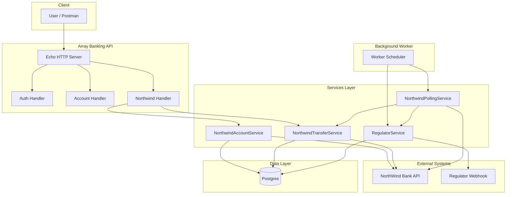
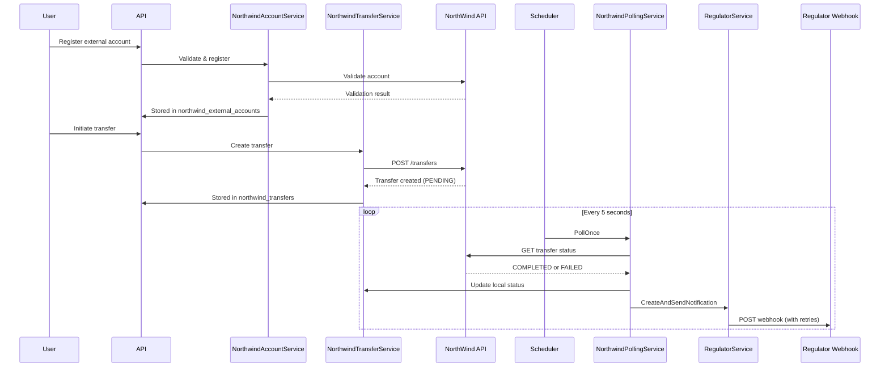

# Array Banking API - Architecture and Changes Explanation

This document describes the architecture of the NorthWind-integrated Array Banking API and summarizes all changes made from the baseline starter project.

---

## Architecture Overview

The application extends the baseline Array Banking API with three main capabilities:

1. **NorthWind Integration** - Connect to NorthWind Bank for external account validation and transfers
2. **Regulator Webhooks** - Notify a regulator within 60 seconds when transfers succeed or fail
3. **Background Worker** - Poll NorthWind for transfer status updates and retry regulator notifications

---

## Data Flow

### Transfer Funds Flow

### Regulator Notification with Retries

The regulator webhook must be delivered within 60 seconds. If the regulator is unavailable:

- Each notification is stored in `regulator_notifications`
- Each delivery attempt is logged in `regulator_notification_attempts`
- Exponential backoff retries (configurable: initial 2s, max 60s)
- The worker runs `RegulatorService.RetryOnce()` every 5 seconds to retry pending notifications
- Database records provide audit proof of compliance

---

## Component Explanations

### 1. NorthWind Integration (`internal/integrations/northwind/`)

| File | Purpose |
|------|---------|
| `client.go` | HTTP client for NorthWind API: validate accounts, create transfers, get transfer status. Includes retries on 5xx and exponential backoff. |
| `models.go` | DTOs for NorthWind API request/response (external accounts, transfers, status) |
| `helpers.go` | Utility functions for the integration |
| `client_test.go` | Unit tests for the client |

### 2. NorthWind Services (`internal/services/`)

| Service | Purpose |
|---------|---------|
| `NorthwindAccountService` | Validates external bank accounts via NorthWind, stores validated accounts in `northwind_external_accounts` |
| `NorthwindTransferService` | Initiates transfers via NorthWind, stores transfer records in `northwind_transfers` |
| `NorthwindPollingService` | Polls NorthWind for transfer status updates; when terminal (COMPLETED/FAILED), updates DB and triggers regulator notification |
| `RegulatorService` | Creates notification records, delivers webhooks to regulator, implements retries with exponential backoff |

### 3. Regulator Notification

- **Compliance**: Must notify regulator within 60 seconds of transfer success/failure
- **Reliability**: Retries if regulator is down; stores proof in DB for audits
- **Tables**: `regulator_notifications` (one per transfer+status), `regulator_notification_attempts` (per attempt log)

### 4. Background Worker (`internal/worker/scheduler.go`)

- Single goroutine with 5-second ticker
- Each tick: (1) `NorthwindPollingService.PollOnce()` - poll NorthWind for status updates; (2) `RegulatorService.RetryOnce()` - retry pending webhook deliveries
- Unified design avoids multiple timer goroutines and keeps worker logic simple

### 5. Configuration

- **NorthWind**: `NORTHWIND_BASE_URL`, `NORTHWIND_API_KEY`, `NORTHWIND_POLL_INTERVAL_SECONDS`, retry settings
- **Regulator**: `REGULATOR_WEBHOOK_URL`, `REGULATOR_RETRY_INITIAL_SECONDS`, `REGULATOR_RETRY_MAX_SECONDS`
- **Environment**: `godotenv` loads `.env.example` (dev) or `.env.production.example` (production) based on `APP_ENV`

---

## Changes from the Starter Project

Baseline: `candidate-golang-project-starter` at `C:\Users\risha\Downloads\candidate-golang-project-starter\candidate-golang-project-starter`

### New Files

| Path | Description |
|------|-------------|
| `NORTHWIND_README.md` | NorthWind integration documentation |
| `internal/integrations/northwind/client.go` | NorthWind HTTP client |
| `internal/integrations/northwind/client_test.go` | Client tests |
| `internal/integrations/northwind/helpers.go` | Integration helpers |
| `internal/integrations/northwind/models.go` | NorthWind API DTOs |
| `internal/handlers/northwind_handler.go` | NorthWind HTTP handlers |
| `internal/models/northwind_external_account.go` | External account model |
| `internal/models/northwind_transfer.go` | NorthWind transfer model |
| `internal/models/regulator_notification.go` | Regulator notification model |
| `internal/repositories/northwind_external_account_repository.go` | External account repository |
| `internal/repositories/northwind_transfer_repository.go` | NorthWind transfer repository |
| `internal/repositories/regulator_notification_repository.go` | Regulator notification repository |
| `internal/repositories/db_helpers.go` | Shared DB helpers |
| `internal/services/northwind_account_service.go` | External account validation service |
| `internal/services/northwind_polling_service.go` | Transfer status polling service |
| `internal/services/northwind_transfer_service.go` | Transfer initiation service |
| `internal/services/regulator_service.go` | Regulator webhook service |
| `internal/services/regulator_service_test.go` | Regulator service tests |
| `internal/worker/scheduler.go` | Background worker for polling + regulator retries |
| `db/migrations/000012_*_northwind_external_accounts_table.*` | northwind_external_accounts table |
| `db/migrations/000013_*_northwind_transfers_table.*` | northwind_transfers table |
| `db/migrations/000014_*_regulator_notifications_table.*` | regulator_notifications table |
| `db/migrations/000015_*_regulator_notification_attempts_table.*` | regulator_notification_attempts table |
| `postman/NorthWind-Integration.postman_collection.json` | Postman collection for NorthWind endpoints |

### Modified Files

| Path | Changes |
|------|---------|
| `cmd/api/main.go` | godotenv loading; NorthWind client, repos, services; regulator service; worker; NorthWind routes |
| `internal/config/config.go` | `NorthWindConfig`, `RegulatorConfig`; env loading for NorthWind and regulator |
| `internal/database/database.go` | Minor adjustments |
| `internal/database/migrator.go` | Migration path or ordering changes |
| `internal/errors/codes.go` | New error codes for NorthWind/regulator flows |
| `internal/errors/response.go` | Response formatting updates |
| `internal/handlers/dev_handler.go` | Refinements |
| `internal/handlers/account_handler_test.go` | Test updates |
| `internal/handlers/auth_handler_test.go` | Test updates |
| `internal/handlers/customer_handler_test.go` | Test updates |
| `internal/models/account.go` | Small change (1 line removed) |
| `internal/models/user.go` | Small changes |
| `internal/repositories/interfaces.go` | New repository interfaces |
| `internal/repositories/user_repository.go` | 13 lines removed |
| `internal/validation/validator.go` | `EchoValidator()` and `echoValidator` for Echo integration |
| `docker-compose.yml` | NorthWind/regulator env vars, services |
| `go.mod` / `go.sum` | Added `github.com/joho/godotenv` |
| `.env.example` | NorthWind/regulator variables |
| `README.md` | Additional instructions |
| `README.docker.md` | Docker documentation updates |

### Removed Files

| Path | Reason |
|------|--------|
| `internal/handlers/validator.go` | Replaced by `internal/validation/validator.go` with `EchoValidator()` |

### Dependency Added

- `github.com/joho/godotenv` - Load `.env` files based on `APP_ENV`

---

## Summary Statistics

- **Approx. lines added**: ~3,900
- **Approx. lines removed**: ~160
- **New Go files**: ~25
- **New migrations**: 4 pairs (000012–000015)
- **New Postman collection**: NorthWind-Integration.postman_collection.json
